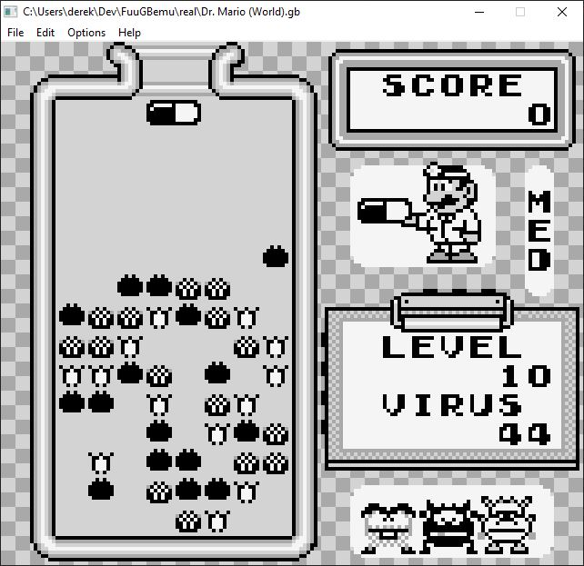
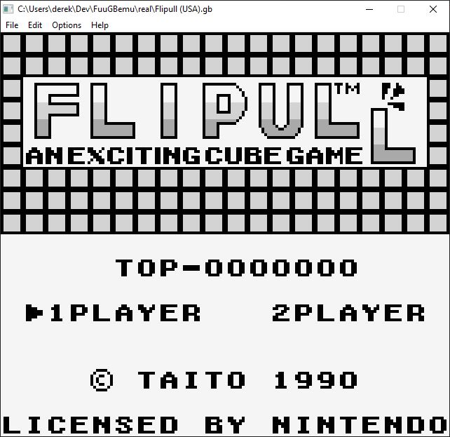
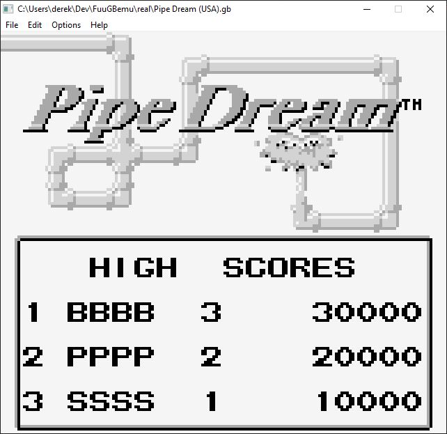

# FuuGBemu

C/C++ DMG GameBoy emulator using GLFW + GLEW (OpenGL 3.3).

Algorithm for the PPU and Memory Management are taken from http://www.codeslinger.co.uk/pages/projects/gameboy.html

All credit goes to codeslinger!

  

## How To Build
    MAC OS X
        (coming soon)
    
    WINDOWS
        (coming soon)

    LINUX/UBUNTU
        1.  Make sure you have the SDL2 development libraries installed. You can get them via your distro's
            package manager. For Ubuntu:
                sudo apt-get install libsdl2-dev
        2.  Download source code for latest stable release of wxWidgets for Linux: 
                https://www.wxwidgets.org/downloads/
        3.  Follow instructions to build/install wxWidgets: 
                https://docs.wxwidgets.org/trunk/plat_gtk_install.html
        4.  Make sure to configure the library with the following options:
                ./configure --with-gtk=3 --with-opengl --enable-debug
        5.  Execute the following command from the root of this repo:
                make debug
        6.  You might need to make the binary executable:
                sudo chmod -x FuuGBemu

## Emulation Accuracy Testing

	The following are tests performed on the emulator to verify its accuracy.
	All tests used are validated test roms that have been tested on real hardware.
	Blargg's test rom suite: https://github.com/retrio/gb-test-roms

## Blargg's CPU Instruction Tests
| Test 		| Fail/Pass |
|------			|-------|
|01-special		| :heavy_check_mark:	|
|02-interrupts		| :heavy_check_mark:	|
|03-op sp,hl		| :heavy_check_mark:	|
|04-op r,imm		| :heavy_check_mark:	|
|05-op rp		| :heavy_check_mark:	|
|06-ld r,r		| :heavy_check_mark:	|
|07-jr,jp,call,ret,rst	| :heavy_check_mark:	|
|08-misc instrs		| :heavy_check_mark: |
|09-op r,r		| :heavy_check_mark:	|
|10-bit ops		| :heavy_check_mark:	|
|11-op a,(hl)		| :heavy_check_mark:	|
