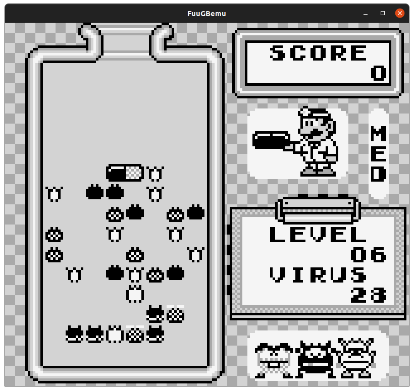
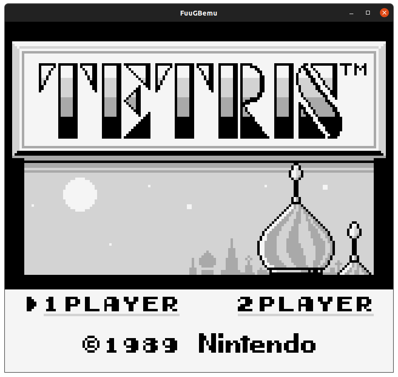
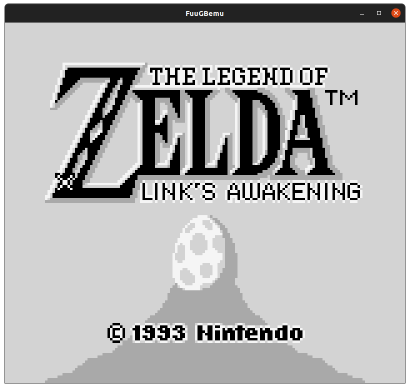

# FuuGBemu

C/C++ DMG GameBoy emulator using GLFW + GLEW (OpenGL 3.3).

Algorithm for the PPU and Memory Management are taken from http://www.codeslinger.co.uk/pages/projects/gameboy.html

All credit goes to codeslinger!

  

## How To Build
    MAC OS X
        (not supported yet)
    
    WINDOWS
        (not supported yet)

    LINUX/UBUNTU
        1.  Make sure you have the build-essential package installed. You will also need some OpenGL libraries. You can get all of those dependencies via your distro's
            package manager. For Ubuntu:
                sudo apt install build-essential libglfw3-dev libglew-dev
            P.S. The build-essential package includes most of the GNU Toolchain such as make, gcc/g++, etc...
        2.  Execute the following command from the root of this repo:
                make debug
            Or
                make release
            if you wish to have an optimized binary without debug symbols.
        3.  You might need to make the binary executable:
                sudo chmod -x FuuGBemu

## Usage

    FuuGBemu
    Usage:
        FuuGBemu [OPTIONS] <rom path>
    Options:
        --skip-boot-rom     Skips the boot rom and enters the game code immediately.

## Controls

    Host Machine -> Emulated Control
    --------------------------------
    Arrow Keys -> D-Pad
    Z -> A
    X -> B
    C -> Start
    V -> Select

    *Controls are currently hardcoded, but will be configurable in the future.

## Emulation Accuracy Testing

	The following are tests performed on the emulator to verify its accuracy.
	All tests used are validated test roms that have been tested on real hardware.
	Blargg's test rom suite: https://github.com/retrio/gb-test-roms

## Blargg's CPU Instruction Tests
| Test 		| Fail/Pass |
|------			|-------|
|01-special		| :heavy_check_mark:	|
|02-interrupts		| :heavy_check_mark:	|
|03-op sp,hl		| :heavy_check_mark:	|
|04-op r,imm		| :heavy_check_mark:	|
|05-op rp		| :heavy_check_mark:	|
|06-ld r,r		| :heavy_check_mark:	|
|07-jr,jp,call,ret,rst	| :heavy_check_mark:	|
|08-misc instrs		| :heavy_check_mark:	|
|09-op r,r		| :heavy_check_mark:	|
|10-bit ops		| :heavy_check_mark:	|
|11-op a,(hl)		| :heavy_check_mark:	|
